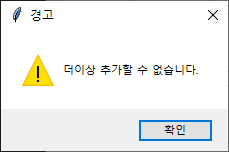

# 파이썬으로 꼬들 구현해보기

## 프로젝트 소개
SeSAC with SaltLux 인공지능 과정의 중간 휴가 기간을 앞두고 뒷풀이겸 술자리에서 언급된 Kordle이라는 웹게임이 있었습니다. 게임 방식이나 룰 들을 듣고 있자니 간단하게 코드로 구현이 가능해 보였고 그 자리에선 웃고 넘겼습니다. 휴가 기간이 끝나고 자연어 처리 과정을 본격적으로 시작하면서 조금씩 구현해본 프로젝트입니다.

[kordle](https://kordle.kr/)
원 게임의 링크입니다.

### 프로젝트 기간
2023.01.25 ~ 2023.01.28

### 참여 인원
[@RynuRen](https://github.com/RynuRen)

### 사용 기술

 

### 개발 환경 및 라이브러리
Windows10, python3.10, vscode, tkinter

# 구현
규칙은 간단합니다.

꼬들에서 설명하는 규칙입니다.

## 단어 쪼개기
neotune님의 python korean handler 코드를 참고했습니다. 추가로 ㄲ같은 쌍자음의 경우 ㄱ,ㄱ으로 나누고 ㅐ와 ㅟ같은 모음들도 ㅏ,ㅣ와, ㅜ,ㅣ로 나누는 과정을 추가했습니다. 또한 게임의 룰에 의해 총 6개의 자모가 아닐 경우 오류 메시지를 출력하도록 했습니다.

## cmd 구현
* run.py

프로그래밍 기초를 배울때 짜봤던 야구게임 방식으로 구현했습니다. 우선 정답을 불러와 단어를 쪼개서 세팅합니다. 사용자에게 입력받은 단어도 쪼개서 6개의 자모에 해당하면 정답과 비교합니다. 자리와 자모가 맞다면 ◎, 자모만 맞다면 △, 다 틀렸다면 Ｘ를 출력하고 6회의 도전 카운트를 체크합니다.

## 단어 합치기
원본 게임과 같이 자판 입력으로 구현하기 위해 tkinter 라이브러리를 사용하기로 했습니다. 원본 게임에서는 입력받는 단어는 국어사전에 등재된 단어만 체크할 수 있습니다. 이 과정에서 입력받은 자모를 하나로 합쳐 국어사전에 등재된 단어인지 체크하는 부분이 들어가야 했습니다.

단어를 쪼개는 과정을 역순으로 구현했습니다. 쌍자음이 되는 과정과 두개의 모음이 하나의 모음이 되는 과정도 추가해야 했습니다.

쪼개는 것과 달리 생각해야할 부분이 많아 어려웠습니다. 남은 길이를 체크하여 모음을 어떻게 처리할지, 종성을 어떻게 처리할지 구현했습니다.

## 단어 체크
국어사전에 등재된 단어인지 체크는 국어사전에 등록된 단어만 따로 리스트를 만들어 두신 acidsound님의 자료를 이용했습니다.

## tkinter gui 구현
* gui.py

tkinter로 자판 gui까지 구현했습니다.

원본 게임과 같이 정답을 색깔로 자판에 표시합니다.

자모를 6개 이상 입력하려고 하면 경고를 합니다.

사전에 없는 단어를 입력하면 경고를 합니다.

6번의 기회안에 성공하지 못하면 결과창에서 재시도 할 수 있습니다.

게임에 성공하면 결과창에 시도횟수와 걸린시간을 출력해줍니다.

# 개선점
* gui입력에서 키보드의 입력을 추가
* 웹으로 구현해서 회원가입과 사용자의 랭킹 추가

# Reference
* [꼬들](https://kordle.kr/)
* neotune: [python korean handler](https://github.com/neotune/python-korean-handler)
* acidsound: [korean_wordlist](https://github.com/acidsound/korean_wordlist)
